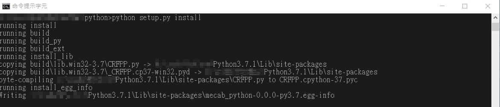

# python-crfpp
### CRF++ In Python Interface ( For Windows )
* **Prepare**
    * Use `Python 3.7` **Must use** `32-bit (x86)` [`64-bit (x64)` can not be used, the reason is unknown. ]
    * `Visual Studio 2015` IDE compile
    * Download CRF++ Package for Windows ( CRF++-0.58.zip )  and Linux ( CRF++-0.58.tar.gz or crfpp )
    * **source in https://taku910.github.io/crfpp/**
        * in Windows package [/CRF++-0.58/sdk/](/CRF++-0.58/sdk/)
            * `crfpp.h`
            *  rename `crfpp.lib` by `libcrfpp.lib`

        * in Windows package [/CRF++-0.58/](/CRF++-0.58/)
            * `libcrfpp.dll`

        *  in [/pthreads-w32-2-9-1-release/Pre-built.2/lib/x64/](/pthreads-w32-2-9-1-release/Pre-built.2/lib/x64/)
            * rename `pthread.lib` by `pthreadVC2.lib`

        * in Linux package [https://github.com/taku910/crfpp/tree/master/python](https://github.com/taku910/crfpp/tree/master/python)
            * get python folder
* **Environment Setting**
    
    Move the prepared files to the [python folder in Linux package](/crfpp/python/) ( besides `libcrfpp.dll` )
    
    **run in cmd**
        
        python setup.py build
        
        
    **run in cmd**
    
        python setup.py install
    
      

* **Use CRF++ in Python**
        
        import CRFPP
    
    
    
    **finally:** Move `libcrfpp.dll` to **your Python library** (/Python3.7/Lib/site-packages/)
